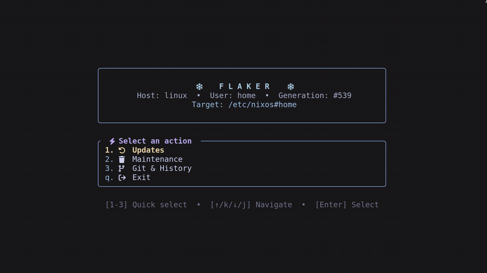
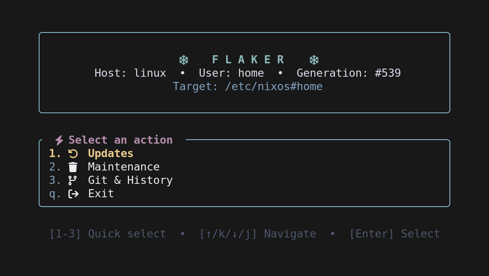
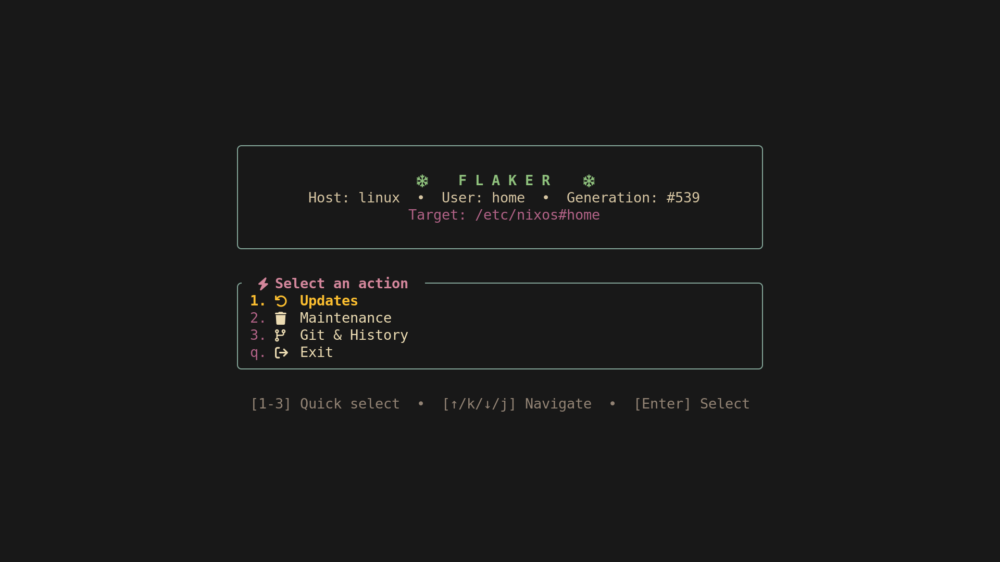
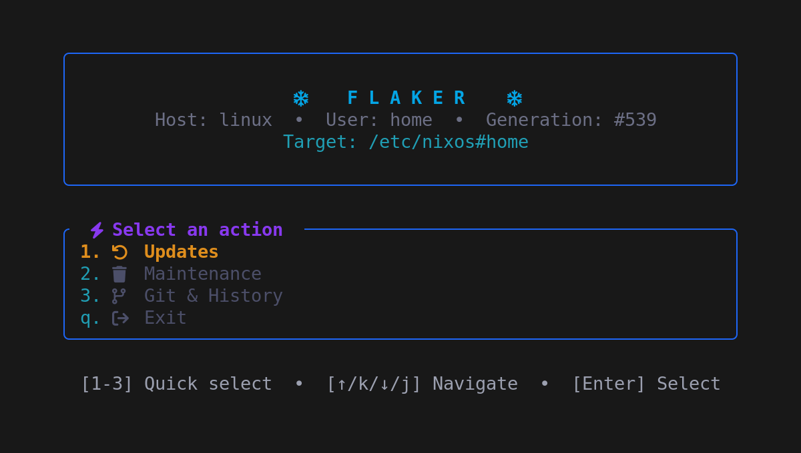
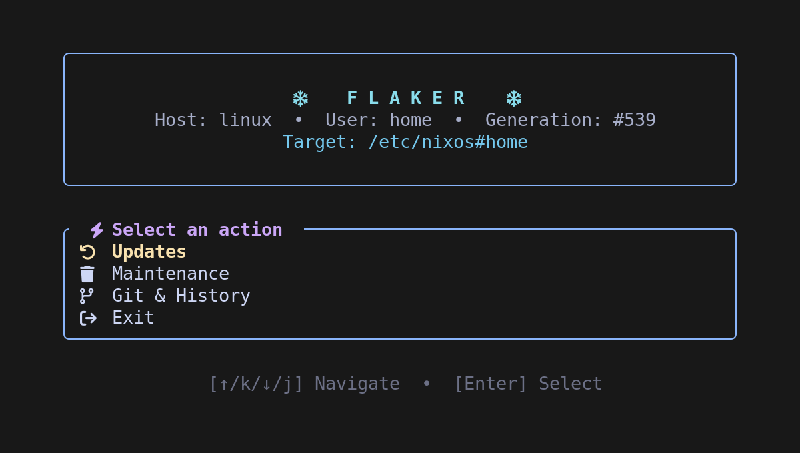

<p align="center">
  <h1 align="center">❄️ Flaker</h1>
  <p align="center">
    <strong>An interactive, aesthetic TUI manager for administering NixOS Flakes</strong>
  </p>
  <p align="center">
    <a href="https://github.com/tw1xale/flaker/releases"></a>
    <a href="https://nixos.org"></a>
    <a href="https://www.rust-lang.org"></a>
    <a href="https://github.com/ratatui/ratatui"></a>
    <a href="LICENSE"></a>
  </p>
</p>

---

<p align="center">
  
</p>

---

## ⚡ Highlights

- 🔨 **Instant NixOS Operations**: Rebuild & switch, update lockfile, full cycle update, and verification builds with single keystrokes.
- 📜 **Built-in Git Management**: Interactive commit history, live syntax-highlighted diffs, soft revert, hard reset, and history squashing.
- 🎨 **Adaptive Theming**: 8 built-in palettes (**Catppuccin** Mocha/Macchiato/Frappé/Latte, **Nord**, **Tokyo Night**, **Dracula**, **Gruvbox**) + custom HEX color overrides.
- ⌨️ **Ergonomic Controls**: Instant single-digit selection (`1`, `2`, `3`...), fixed `q` shortcut for Back/Exit, and full key rebinding via `config.toml`.
- 🛡️ **Safe & Intelligent**: Destructive actions require modal confirmation; non-root user configurations run cleanly without unnecessary `sudo`.
- 🪟 **Terminal Transparent**: Never forces an opaque background fill, matching your terminal emulator's blur and opacity out of the box.

---

## 🎨 Theme & Mode Gallery

<table>
  <tr>
    <th width="50%" align="center">❄️ Nord Palette</th>
    <th width="50%" align="center">🍂 Gruvbox Palette</th>
  </tr>
  <tr>
    <td align="center"></td>
    <td align="center"></td>
  </tr>
  <tr>
    <th width="50%" align="center">☕ Latte Palette</th>
    <th width="50%" align="center">🔢 Classic Mode (<code>enable_quick_digits = false</code>)</th>
  </tr>
  <tr>
    <td align="center"></td>
    <td align="center"></td>
  </tr>
</table>

---

## 📦 Declarative Installation (Flakes)

> [!NOTE]
> Flaker requires a [Nerd Font](https://www.nerdfonts.com/) (or a Nerd Font patched terminal font) to display its icons correctly.

### 1. Add to your system `flake.nix`

Add Flaker to your `inputs`:

```nix
{
  inputs = {
    nixpkgs.url = "github:NixOS/nixpkgs/nixos-unstable";
    
    # Flaker input
    flaker.url = "github:tw1xale/flaker";
  };

  outputs = { self, nixpkgs, flaker, ... }@inputs: {
    nixosConfigurations.home = nixpkgs.lib.nixosSystem {
      system = "x86_64-linux";
      specialArgs = { inherit inputs; };
      modules = [
        ./configuration.nix
      ];
    };
  };
}
```

### 2. Add package to `configuration.nix` (or `home.nix`)

```nix
{ pkgs, inputs, ... }:

{
  environment.systemPackages = [
    inputs.flaker.packages.${pkgs.stdenv.hostPlatform.system}.default
  ];
}
```

*(Alternatively, use the overlay: `nixpkgs.overlays = [ inputs.flaker.overlays.default ];` and add `pkgs.flaker` to your packages).*

After rebuilding (`nixos-rebuild switch`), the `flaker` command is available in your shell:

```bash
flaker
```

---

## 🚀 Quick Run (Without Installing)

You can run Flaker directly without modifying your system configuration:

```bash
nix run github:tw1xale/flaker
```

---

## 🗂️ Menu Structure & Features

All system administration actions are categorized into clean submenus:

### 🔨 Updates
- **Rebuild System (`rebuild switch`)**: Checks for uncommitted changes, prompts for a commit message (with sensible default), commits, builds, switches configuration, and pushes to remote.
- **Update Lockfile (`flake update`)**: Updates `flake.lock`, commits only the lockfile, and pushes to remote.
- **Full Cycle (`update + switch`)**: Runs `flake update`, commits pending changes, rebuilds & activates the new generation, and pushes to remote.
- **Test Build**: Executes `nixos-rebuild build` to verify configuration compilation without activating it on the running system.

### 🧹 Maintenance
- **Clean Garbage & Optimize Store**: Three-step cleanup (`nix-collect-garbage -d` → `nix-store --gc` → `nix-store --optimise`). *Requires confirmation.*
- **System Generations History**: Inspects all system generations in an interactive, scrollable pager.

### 📜 Git & History
- **Show Working Changes (Git Diff)**: Integrated scrollable diff viewer with syntax highlighting (green for additions, red for deletions, mauve for hunk headers).
- **Hard Reset Rollback (`git reset --hard`)**: Interactive commit selector → safety warning modal → hard reset → force push → switch system. *Requires confirmation.*
- **Soft Revert Rollback (`git checkout <hash> -- .`)**: Interactive commit selector → restores tree state → records a new commit → pushes and switches system.
- **Trim History (`git reset --soft`)**: Interactive commit selector → squashes commit history back to target commit while preserving working tree files → force push. *Requires confirmation.*

---

## ⚙️ Universal Auto-Discovery

Flaker automatically discovers your NixOS setup, permissions, and Git integration:

- **Smart Directory Discovery**: Searches current directory (`.`), `~/.config/nixos`, `~/dotfiles/nixos`, `~/dotfiles`, `~/nixos-config`, `~/nixos`, and `/etc/nixos`.
- **Target Auto-Detection**: Inspects `flake.nix` and matches `nixosConfigurations.<name>` against your system hostname or username.
- **Root & User-Space Support**: If your configuration resides in your home directory, Git and Flake operations run without `sudo`. `sudo` is only invoked when elevated privileges are actually required (e.g. `nixos-rebuild switch` or `/etc/nixos`).
- **Standalone / Non-Git Support**: Non-Git flake repositories work seamlessly out-of-the-box without Git prompts or errors.

To explicitly override the target or directory, use the environment variables:

```bash
# Explicit target override
FLAKER_TARGET="/home/username/dotfiles#my-host" flaker

# Explicit directory override
FLAKER_DIR="/home/username/dotfiles" flaker
```

---

## ⌨️ Custom Configuration (`config.toml`)

Flaker automatically creates a configuration file at `~/.config/flaker/config.toml` (or `~/.config/flaker.toml`) on first launch with sensible defaults.

```toml
# ~/.config/flaker/config.toml

[general]
# Explicit flake directory path (leave empty for automatic detection)
# Examples: "/etc/nixos", "~/dotfiles/nixos", "~/my-config"
flake_dir = ""

# Explicit flake target (leave empty for automatic detection)
# Examples: "/etc/nixos#hostname", "~/dotfiles#my-user"
flake_target = ""

[theme]
# Color palette. Available options:
# "mocha" (default), "macchiato", "frappe", "latte",
# "nord", "tokyonight", "dracula", "gruvbox"
palette = "mocha"

# Optional custom color overrides (HEX format):
# border = "#89b4fa"
# accent = "#cba6f7"
# selected = "#f9e2af"
# header_title = "#89dceb"

[commit_templates]
# Default commit messages for automatic actions
rebuild = "rebuild"
flake_update = "flake update"
full_cycle = "full update"
soft_revert = "revert to {hash}"
trim_history = "trim history to {hash}"

[keybindings]
# Enable instant single-digit selection (1, 2, 3...) for menu items
enable_quick_digits = true

# Key assigned to the Back / Exit menu item (e.g. "q", "b", "Esc")
back_item_key = "q"

# Navigation keys
up = ["Up", "k"]
down = ["Down", "j"]
page_up = ["PageUp"]
page_down = ["PageDown"]
home = ["Home"]
end = ["End"]

# Action keys
select = ["Enter"]
back = ["Esc"]
quit = ["q", "Ctrl-c"]
clear_input = ["Ctrl-u"]
```

---

## 🛠️ Local Development

```bash
# Enter development shell
nix develop

# Run test suite
cargo test

# Build debug / release binary
cargo build --release
```

---

## 📄 License

This project is licensed under the [MIT License](LICENSE).

